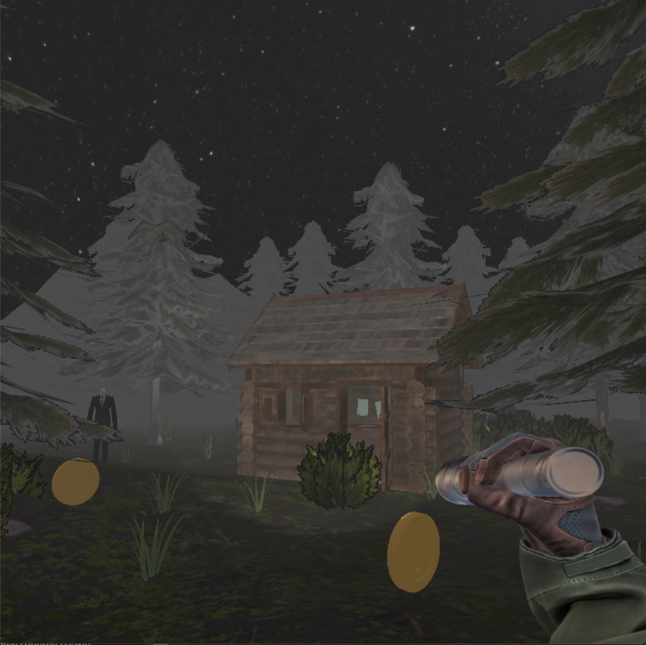
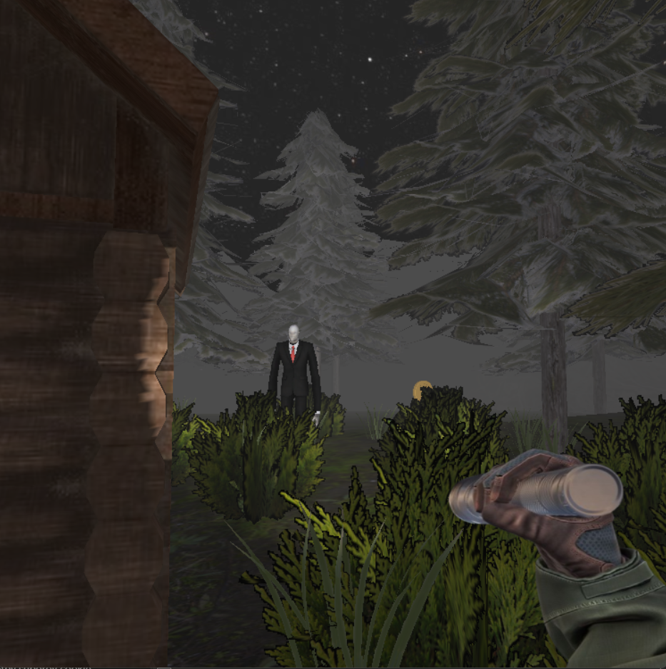
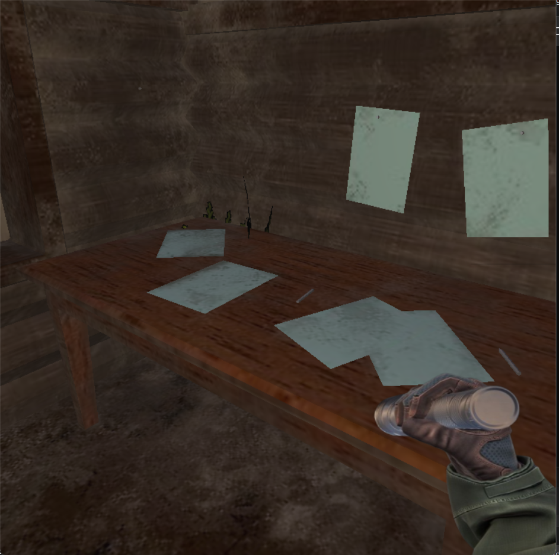
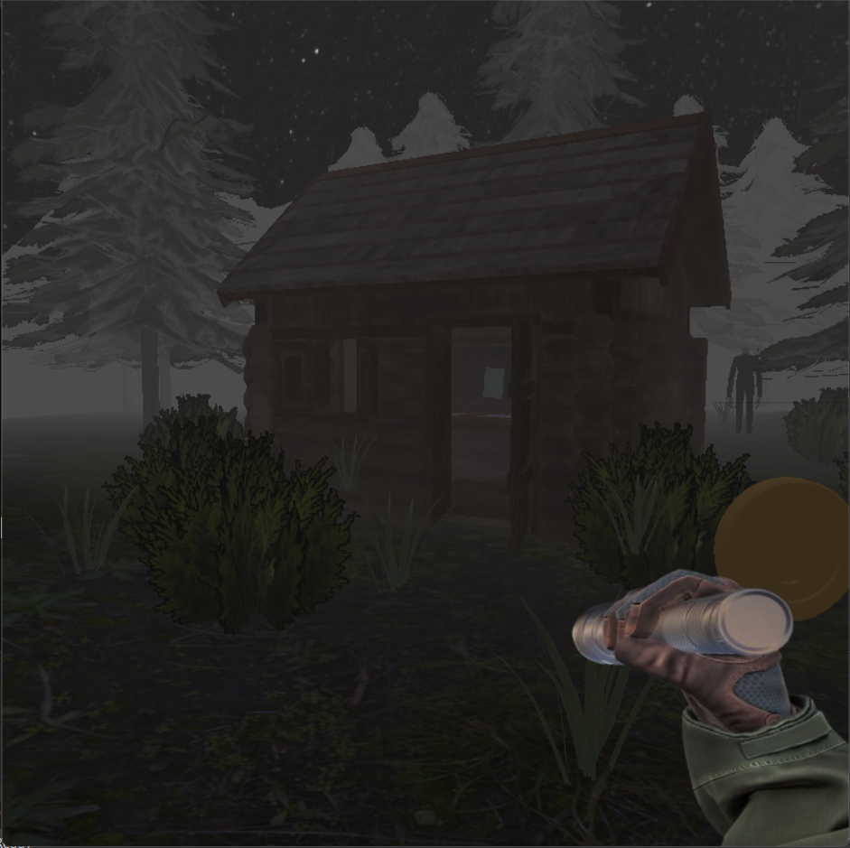

# OpenGL Interactive 3D Scene

## Project Overview

This project is an interactive 3D scene developed in C++ using OpenGL (PGR framework). It is inspired by the atmosphere of *Slender: The Eight Pages*, focusing on exploration, minimal gameplay interaction, and immersive environmental design.

The application features a dark forest setting with first-person navigation, dynamic lighting, animated elements, and simple collectible-based interaction.

---

## Features

- First-person camera system with mouse and keyboard controls  
- Interactive environment with collectible objects  
- Dynamic lighting system (directional, spotlight, point light)  
- Animated objects and environmental elements  
- Multiple camera modes (free movement and predefined views)  
- Basic gameplay loop with object interaction and visual feedback  

---

## Environment

The scene represents a forest environment composed of:

- Terrain with ground and mountain formations  
- Vegetation (trees, bushes, grass generated in patches)  
- A cabin structure serving as an interactive area  
- A skybox for environmental immersion  

Additional scene elements include:

- A custom static chair model loaded manually from vertex data  
- A crow flying in circular motion above the cabin  
- A Slenderman-inspired entity that periodically changes position

---

## Player and Camera

The application uses a first-person camera system:

- Free movement using keyboard input  
- Mouse-controlled camera rotation  
- Ability to toggle mouse locking for interaction  
- Multiple predefined static camera positions  

---

## Interaction System

The main interactive element consists of collectible coins:

- Coins are randomly placed within the environment  
- Each coin rotates continuously  
- Coins can be collected via mouse input when the cursor is unlocked  

### Implementation Details

- Object selection is handled using stencil buffer picking  
- Each coin is assigned a unique ID  
- Mouse clicks trigger `glReadPixels` to identify selected objects  
- Collected coins are removed from the scene  

### Visual Feedback

- Collected coins disappear from the scene  
- A temporary sparkle animation is displayed at the collection point  

---

## Lighting System

The project implements multiple types of lighting:

### Directional Light
- Simulates ambient moonlight  
- Low intensity to maintain a dark atmosphere  

### Flashlight (Spotlight)
- Attached to the player  
- Toggleable via input  
- Supports dynamic color switching  

### Point Light
- Located inside the cabin  
- Toggleable via input  
- Includes a flickering effect implemented using time-based functions and noise  

---

## Shaders

Custom GLSL shaders are used for rendering:

- Vertex shader performs lighting calculations in eye space  
- Supports multiple light sources:
  - Directional light  
  - Point light with attenuation  
  - Spotlight (flashlight)  

Additional features include:

- Dynamic flickering effects  
- Configurable light color via uniforms  

---

## Animation

The project includes several animated elements:

- Crow movement along a parametric closed curve  
- Coin rotation  
- Sparkle effects with limited lifetime  

---

## Game Logic

Core logic is handled within the update loop:

- Player movement and camera updates  
- Periodic teleportation of the Slenderman entity  
- Continuous animation updates (crow, coins)  
- Lifecycle management of temporary effects (e.g., sparkles)  

---

## Custom Model

A static chair model is implemented manually:

- Loaded from raw vertex and index data  
- Uses VAO, VBO, and EBO  
- Includes position, normal, and texture attributes  
- Orientation adjusted during development  

---

## Controls

### Keyboard

- `W / A / S / D` or arrow keys – movement  
- `F` – toggle flashlight  
- `P` – toggle cabin light  
- `C` – change flashlight color  
- `1, 2, 3` – switch to predefined camera views  
- `0` – return to player camera  
- `Space` – toggle mouse lock  

### Mouse

- Movement – camera rotation  
- Click – collect coins  

---

## Technologies

- C++  
- OpenGL  
- GLSL  
- PGR framework  

---

## Notes

This project focuses on combining real-time rendering techniques with basic interaction mechanics to create an atmospheric 3D experience. It demonstrates work with shaders, lighting models, object picking, and scene management.
